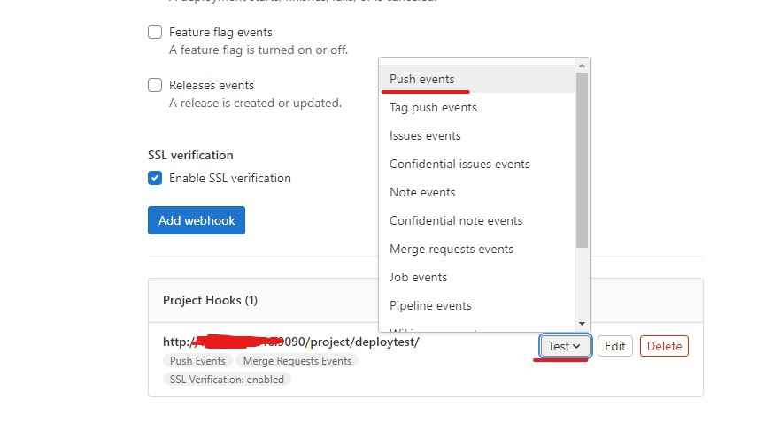

# 포팅 매뉴얼

# 1. 개발 환경

**형상 관리**

- Gitlab

**이슈 관리**

- Jira

**IDE**

- IntelliJ IDEA 2021.2.4
- Visual Studio Code

**Communication**

- Mattermost
- Webex
- Notion

**OS**

- Ubuntu 20.04

**Server**

- AWS EC2
    - Ubuntu 20.04 LTS
    - Docker 23.00

**DataBase**

- MySQL 8.0.32

**기타 편의 툴**

- Postman v10.10.0
- MobaXterm v22.3

**Front-End**

- React v18.2.0
- Nginx Stable-alphin

**Back-End**

- Spring Boot v2.7.8
- Apache Tomcat 9.0.71
- Java JDK 11.0.17
- Node.js 16.18.0
- Python 3.11

**IoT**

- MoveNet single pose lightening ptq etch tpu

# 2. EC2 백엔드 & 프런트엔드 빌드

## 사전 패키지 설치

```jsx
sudo apt update
sudo apt-get install -y ca-certificates \
    curl \
    software-properties-common \
    apt-transport-https \
    gnupg \
    lsb-release
```

도커를 설치하기 위한 gpg Key를 다운해야 합니다.

```jsx
sudo mkdir -p /etc/apt/keyrings
curl -fsSL https://download.docker.com/linux/ubuntu/gpg | sudo gpg --dearmor -o /etc/apt/keyrings/docker.gpg

echo \
    "deb [arch=$(dpkg --print-architecture) signed-by=/etc/apt/keyrings/docker.gpg] https://download.docker.com/linux/ubuntu \
    $(lsb_release -cs) stable" | sudo tee /etc/apt/sources.list.d/docker.list > /dev/null
```

## Docker 설치

`apt update`를 다시 실행해주고, 아래 명령어를 통해 도커를 설치합니다. `docker-compose`는 추가로 설치합니다.

```jsx
sudo apt update
sudo apt install docker-ce docker-ce-cli containerd.io docker-compose
```

## docker-compose를 이용해 젠킨스 컨테이너 생성

위 사진과 같이 명령어를 쳐서 `docker-compose.yml` 파일을 vim을 이용하여 생성해줍니다.

docker-compose.yml 파일

```jsx
version: '3'

services:
    jenkins:
        image: jenkins/jenkins:lts
        container_name: jenkins
        volumes:
	    - /usr/bin/docker:/usr/bin/docker
            - /var/run/docker.sock:/var/run/docker.sock
            - /jenkins:/var/jenkins_home
        ports:
            - "9090:8080"
        privileged: true
        user: root
```

파일을 저장한 후 `sudo docker-compose up -d` 명령어를 입력하여 컨테이너를 생성해줍니다.

## Jenkins 계정 생성 및 플러그인 설치

서버 공인 IP:9090 포트로 접속하면 Administrator password를 요구하는데 `sudo docker logs jenkins` 명령어를 통해 위 사진의 빨간 네모 상자 안의 값을 입력해줍니다. 다음으로 두 개의 버튼 중 `Install suggested plugins`를 클릭해줍니다.

계정은 임의로 생성해주고 Jenkins 관리의 플러그인 관리에서 gitlab을  검색한 후

- Gitlab
- Generic Webhook Trigger
- Gitlab API
- GitLab Authentication

위 4가지를 선택 후 `install witout restart`버튼을 클릭해줍니다.

또한 docker를 검색한 후

- Docker
- Docker Commons
- Docker Pipeline
- Docker API

위 4가지를 선택 후 `install witout restart`버튼을 클릭해줍니다.

마지막으로 SSH를 검색한 후

- Publish Over SSH

위의 플러그인을 설치해줍니다.

## gitlab에 React서버와 Spring Boot 서버 파일 경로!

React : S08P12C101/frontend/auth

Spring Boot : S08P12C101/backend/fairytalebox

## 젠킨스 설정

Jenkins 프로젝트 생성 → 새로운 item 클릭 → talebox라는 명으로Freestyle project 생성 후


`소스코드 관리` 탭을 클릭하고, None로 되어있는 것을 git 라디오 버튼을 클릭하면 아래에 Form이 나타납니다. 아래에 있는 밑줄은 빌드할 브랜치 이름을 적어줍니다.


`Repository URL`에는 싸피깃 레포지토리 URL을 입력해줍니다. 위 사진처럼 에러 메시지가 나타나는 것이 지금 단계에서는 정상입니다.


`Credentials`에서, `add` -> `jenkins`를 클릭해줍니다.


위 내용 입력하고 `Add` 버튼 클릭합니다.


`Credentials`에서 이제 만들어진 `Credential`을 선택했을 때 오류메시지가 사라지면 성공입니다.


다음은 빌드 유발 탭입니다. 빌드 유발 탭에서는 먼저 밑줄 친 부분의 체크박스를 체크해줍니다. 그 후 생기는 고급 버튼을 클릭합니다.


그 후 조금 스크롤을 내려 `Secret token`을 찾아 Generate 버튼을 누르면 사진과 같이 토큰이 생성됩니다. 이 토큰은 Gitlab과 WebHook을 연결할 때 사용되니 저장해둡니다.


다음은 Build 탭입니다. `Add build step`를 클릭하고, `Execute Shell`을 선택해줍니다.


다음과 같이 명령어를 입력할 수 있는 칸이 나타납니다. 일단 연결만 테스트하는 것이기 때문에 pwd 명령어를 입력하겠습니다.

여기까지 모두 완료했다면 저장 버튼을 눌러 저장합니다.


저장 버튼을 누르면 위 사진처럼 프로젝트 화면으로 이동합니다. 일단 `지금 빌드` 버튼을 눌러서 젠킨스 수동 빌드를 진행해봅니다. 아래 밑줄처럼 완료 표시가 뜨면 성공한 것입니다.

## 깃랩 WebHook 연결


배포할 프로젝트가 있는 깃랩 `Repository`에서 밑줄친 위치로 `WebHooks` 페이지로 이동합니다.


URL에는 `http://배포서버공인IP:9090/project/생성한jenkins프로젝트이름/`을 입력해줍니다. Secret token에는 아까 위에서 젠킨스 프로젝트를 생성할 때 저장해둔 값을 입력합니다. 빌드 유발 Trigger으로, `Push events, Merge request events`를 설정합니다. 대상 Branch는 master으로 설정합니다. 완료했다면 Add Webhook 버튼을 눌러 webhook을 생성합니다.



WebHook을 생성하고 나면 빌드 테스트를 위해 생성된 WebHook에서 test를 누르고, Push events를 선택해줍니다.


응답이 잘 넘어온 것을 확인할 수 있습니다. (code 200)

## 젠킨스와 연결된 gitlab 프로젝트로 도커 이미지 빌드하기

프로젝트에 Dockerfile 작성

Spring Boot Project DockerFile

```docker
FROM adoptopenjdk/openjdk11 AS builder
COPY gradlew .
COPY gradle gradle
COPY build.gradle .
COPY settings.gradle .
COPY src src
RUN chmod +x ./gradlew
RUN ./gradlew bootJAR

FROM adoptopenjdk/openjdk11
COPY --from=builder build/libs/*.jar app.jar
EXPOSE 8080
ENTRYPOINT ["java", "-jar", "/app.jar"]
```

React Project DockerFile

```docker
FROM node:16.15.0 as build-stage
WORKDIR /var/jenkins_home/workspace/talebox/frontend/auth
COPY package*.json ./
RUN npm install
COPY . .
RUN npm run build
FROM nginx:stable-alpine as production-stage

COPY --from=build-stage /var/jenkins_home/workspace/talebox/frontend/auth/build /usr/share/nginx/html
COPY --from=build-stage /var/jenkins_home/workspace/talebox/frontend/auth/deploy_conf/nginx.conf /etc/nginx/conf.d/default.conf
EXPOSE 80
CMD ["nginx", "-g","daemon off;"]
```

젠킨스 프로젝트 페이지에서, 구성 버튼을 클릭합니다. 프로젝트 생성할 때의 창과 비슷한 창이 나타납니다. Build 탭으로 이동하고, 아까 프로젝트 생성할 때 pwd로 적어두었던 명령어를 다음 명령어로 바꾸어줍니다.

```docker
docker build -t backimg ./backend/fairytalebox
if (docker ps | grep "backimg"); then docker stop backimg; fi
docker run -it -d --rm -p 8080:8080 --name backimg backimg
echo "Run Backend!"
pwd
docker build -t frontimg ./frontend/auth
if (docker ps | grep "frontimg"); then docker stop frontimg; fi
docker run -it -d --rm -p 80:80 --name frontimg frontimg
echo "Run Frontend!"
```

지금 빌드 버튼을 눌러 빌드해줍니다!


## Nginx를 통해 React와 Spring Boot 경로 설정

SSAFY의 EC2는 허용하는 포트에 제한이 걸리기 떄문에, Reverse Proxy 작업을 하지 않으면 서버에 접근이 불가능한 경우가 생길 수 있습니다. 따라서 80 Port에서 백과 프론트, 두 서비스를 구분 짓는 부분이 필요합니다.

마지막 Nginx 설정 부분입니다. 이 과정은, 기존 리액트와 포트가 분리되어 8080 포트를 이용해야 접속 가능한 백엔드 서비스를 80 포트를 통해 접속할 수 있도록 변경시켜주는 작업입니다.


nginx.conf 파일

```docker
upstream backend{
	ip_hash;
	server i8c101.p.ssafy.io:8080;
}

server {
    listen       80;
    listen  [::]:80;
    server_name  i8c101.p.ssafy.io;

    #access_log  /var/log/nginx/host.access.log  main;

    location / {
        root   /usr/share/nginx/html;
        index  index.html index.htm;
        try_files $uri $uri/ /index.html;
    }

	location /api {
        proxy_pass http://backend;
        proxy_redirect     off;
        proxy_set_header   Host $host;
        proxy_set_header   X-Real-IP $remote_addr;
        proxy_set_header   X-Forwarded-For $proxy_add_x_forwarded_for;
    }

    #error_page  404              /404.html;

    # redirect server error pages to the static page /50x.html
    #
    error_page   500 502 503 504  /50x.html;
    location = /50x.html {
        root   /usr/share/nginx/html;
    }

    # proxy the PHP scripts to Apache listening on 127.0.0.1:80
    #
    #location ~ \.php$ {
    #    proxy_pass   http://127.0.0.1;
    #}

    # pass the PHP scripts to FastCGI server listening on 127.0.0.1:9000
    #
    #location ~ \.php$ {
    #    root           html;
    #    fastcgi_pass   127.0.0.1:9000;
    #    fastcgi_index  index.php;
    #    fastcgi_param  SCRIPT_FILENAME  /scripts$fastcgi_script_name;
    #    include        fastcgi_params;
    #}

    # deny access to .htaccess files, if Apache's document root
    # concurs with nginx's one
    #
    #location ~ /\.ht {
    #    deny  all;
    #}
}
```

마스터 브랜치에 푸쉬 또는 merge하면 자동으로 빌드가 진행됩니다!

[사진 및 내용 출처] [https://github.com/hjs101/CICD_manual/tree/main/매뉴얼 v2#젠킨스-프로젝트-생성-webhook-설정-자동-빌드-테스트](https://github.com/hjs101/CICD_manual/tree/main/%EB%A7%A4%EB%89%B4%EC%96%BC%20v2#%EC%A0%A0%ED%82%A8%EC%8A%A4-%ED%94%84%EB%A1%9C%EC%A0%9D%ED%8A%B8-%EC%83%9D%EC%84%B1-webhook-%EC%84%A4%EC%A0%95-%EC%9E%90%EB%8F%99-%EB%B9%8C%EB%93%9C-%ED%85%8C%EC%8A%A4%ED%8A%B8)

# 3. 엣지 디바이스 백엔드 & 프런트엔드 실행

gitlab master branch를 clone해오면 됩니다!

node.js version : 16.18.0

python version : 3.11

## 백엔드

/S08P12C101/backend에서

- /poseAPI →  python3 pose.py로 실행
- /talebox_nodejs/backend에서

      npm install → npm start

두 가지를 전부 실행시켜주어야 합니다!

## 프런트

/S08P12C101/frontend/my-app에서

npm install → npm start 하면 실행됩니다!

# 4. test용 ID&PW

ID : [test1@naver.com](mailto:test1@naver.com)

PW : tmdgus0528!

# 5. MySQL 설정

EC2 터미널에서

```docker
sudo apt update
sudo apt install mysql-server
```

설치 후 MySQL을 워크벤치(외부)에서 접속을 하기 위한 설정을 해줘야 한다.

```docker
cd /etc/mysql/mysql.conf.d
vi mysqld.cnf
```

bind-address 127.0.0.1 가 적힌 줄 맨앞에 # 를 넣어 주석처리 해주기


esc입력후 :wq를 입력하여 저장 후 파일을 종료한다.

mysql 실행

```bash
/usr/bin/mysql -u root -p
```

외부접속 허용 sql문 입력

```sql
create user '유저명'@'%' identified by '비밀번호';
grant all privileges on *.* to '유저명'@'%' with grant option;
```

mysql 재시작

```bash
service mysql restart
ufw allow out 3306/tcp
ufw allow in 3306/tcp
service mysql restart
```

이후 dumpdata를 import 해준다.

```sql
mysql -u root -p

CREATE DATABASE 데이터베이스이름
USE 데이터베이스이름
source S08P12C101/exec/dumpdata/talebox.sql
```
